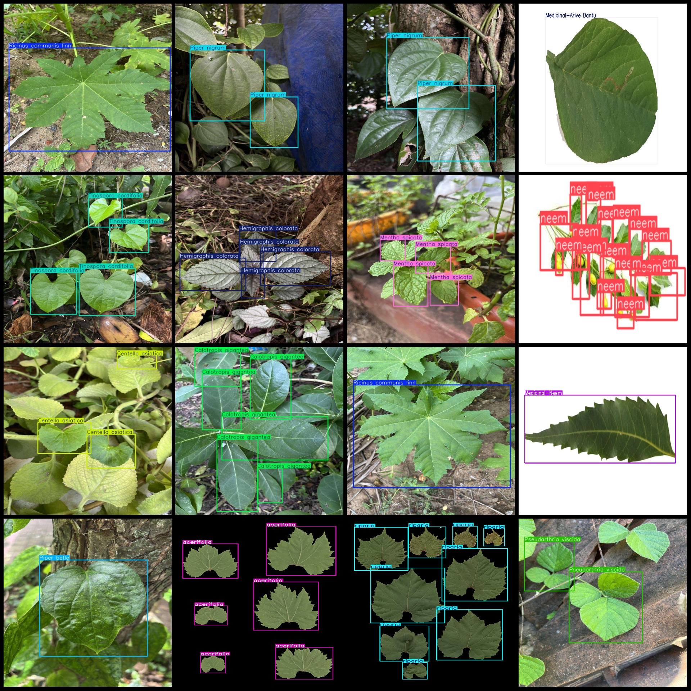
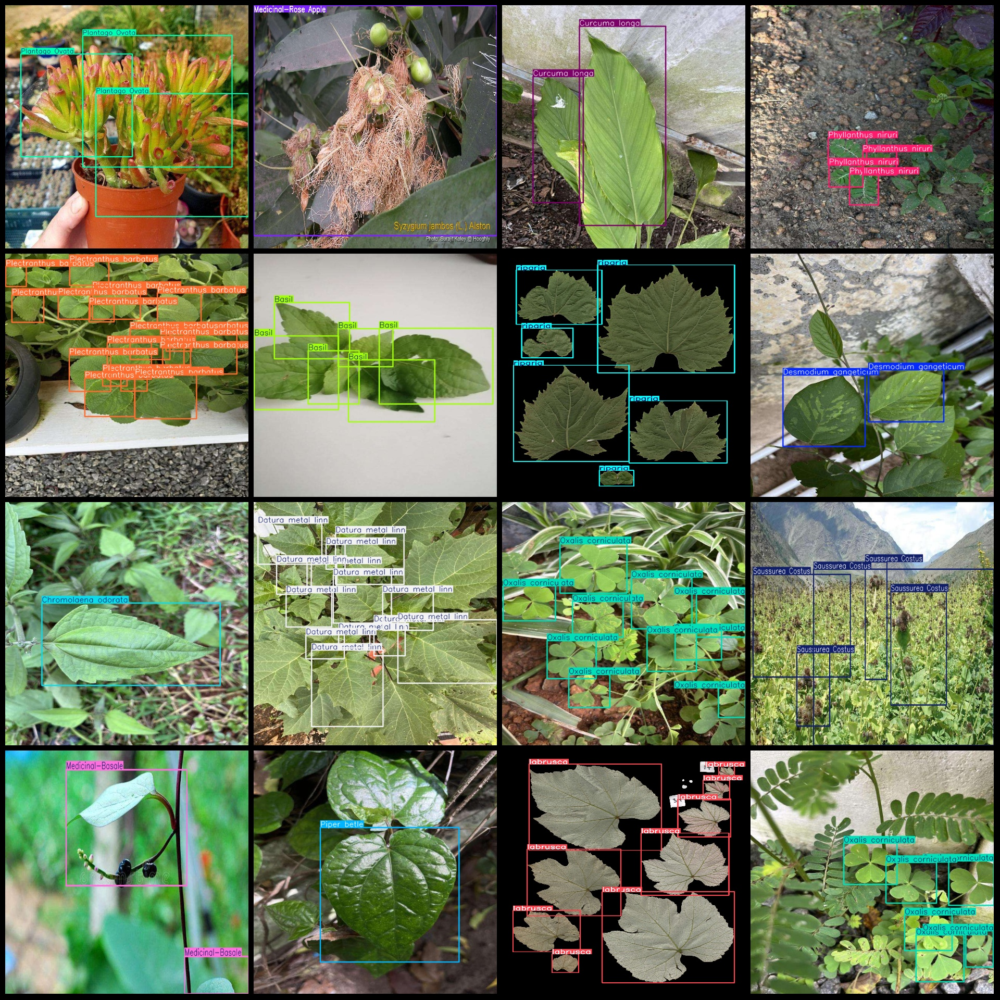

# Common Medicinal Herb and Herb Detection Data Set in VOC+YOLO format with 9229 images and 143 categories

Kinugawa/Loquat
- **class**: Acacia
The number of frames is 3.

## Ayu La / Jia Ma Xian
- **class**: Ajwain
The given problem seems to be about a specific number of frames, but the question is not clear. It could refer to the number of objects in a dataset, the number of images in a video, or any other context. Without more information, it's impossible to provide a precise translation.

## Anak/Da Ye Shou Moja
- **class**: Andrographis paniculata
- **Number of boxes**: 1

Amland/Lemongrass
- **class**: Amomum villosum
- **Number of Frames**: 240

Ankor/Indian Clove
Aniram is a genus of flowering plants in the family Asteraceae, native to tropical Asia and the Pacific islands. It contains several species that are known for their beautiful flowers and fragrant scents. Some common species include Aniram japonica, Aniram micranthum, and Aniram pacificum.
- **Boxes**: 34

## Anand/Indian Pistachio
- **class**: Azadirachta indica
- **Number of boxes**: 14

Annual/Indian Myrrh
- **class**: Angelica dahurica
- **Boxes**: 65

Arun/Indian Mouthful
- **class**: Aristolochia arvali
The number of frames is 374.

## Anlan / Indian Teak
- **class**: Azadirachta indica
- **Number of boxes**: 35

## Assaf/Zephyr
**Ambrosia trifida** is an edible fungus found in the family Polyporaceae. It has a white to pale yellow cap and a whitish stem. The fruit bodies are round or slightly flattened, with a smooth or slightly rough surface. The spore print is white to light yellow.
- **Number of Frames**: 34

Amanra/Indian fennel
- **class**: Anitrops hispida
- **Number of boxes**: 34

Amara/Indian Myrrh
- **class**: Anitrops javanica
- **Number of boxes**: 29

Apple is a fruit that grows in the United States. It has a sweet taste and is often used in desserts.
- **class**: Arctium lappa
- **Number of Frames**: 65

## Aster tataricus
- **Category**: Aster
- **Frames**: 1206

Amaranth/Lupinus
- **class**: Baccharis salicifolia
- **Number of frames**: 284

## Betula alba
- **class**: Betula alba
- **Number of frames**: 18

Amanra/Bupleurum
- **class**: Bupleurum chinense
- **Boxes**: 18

Annamara/Cumin
- **class**: Boswellia carterii
- **Frames**: 20

Amanar/Koko
- **class**: Cardamom
The number of frames is 21.

Ammonium citrate
- **class**: Fenugreek
- **Number of boxes**: 5

Ammandar/Bergerac
- **class**: Ginger
- **Number of Frames**: 30

## Anmara/Cornflower
- **Category**: Geranislava trifolia
- **Frames**: 34

## Amana/Curcuma
- **class**: Curcuma longa
- **Number of Boxes**: 9

## Azadirachta indica
- **class**: Indian Plum
- **frames**: 14

Amanra (Indian nutmeg)
- **class**: Anitrops javanica
- **Number of boxes**: 29

Apple is a fruit that grows in Asia, specifically in China and India. It is also known as the apple orchard rose. Apples are round and have a smooth surface. They come in different colors such as red, green, yellow, and black. The flesh inside is sweet and juicy. Apples are often eaten raw or cooked with other ingredients like cinnamon, honey, or lemon.
- **class**: Arctium lappa
The number of boxes is 65.

Amanita/Amanitum
- **class**: Hibiscus sabdariffa
- **Frames**: 1206

## Aster tataricus
- **Category**: Aster
- **Frames**: 1206

Ammanra/Red Bean
- **class**: Capsicum annuum
- **Number of boxes**: 7

## Azadirachta indica
- **Category**: Azadirachta indica
- **Frames**: 14

## Anitrops javanica
- **class**: Anitrops javanica
- **Frames**: 29

Apple
- **class**: Arctium lappa
- **Total frames**: 65

## Anmanra/Ceci
- **Category**: Baccharis salicifolia
- **Frames**: 284

Amanar/White Birch
- **class**: Betula alba
- **Number of boxes**: 18

Anmanla/Chaihu
- **class**: Bupleurum chinense
- **Frames**: 18

## Amara/Turmeric
- **class**: Boswellia carterii
- **Frames**: 20

Ammanra/Dokor
- **class**: Cardamom
- **Number of boxes**: 21

Amanra/Prunus amygdalus
- **class**: Fenugreek
- **Total Frames**: 5

Anamras/French fig
- **class**: Ginger
- **Frames**: 30

## Anmanra/Cornflower
- **Category**: Geranislava trifolia
- **Frames**: 34

Amanor/Yellow Ginger
- **class**: Curcuma longa
- **Number of boxes**: 9
## Images

Here is a pay link on Stripe ( https://buy.stripe.com/3cs8yP7sY87d0vu9AB ). Please contact me lonlonago@foxmail.com after funding $89, and I will send you a complete data files , thank you!

